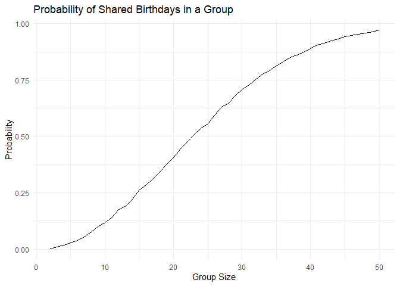
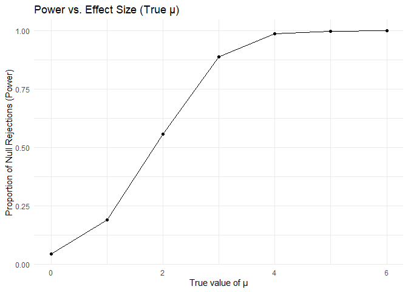
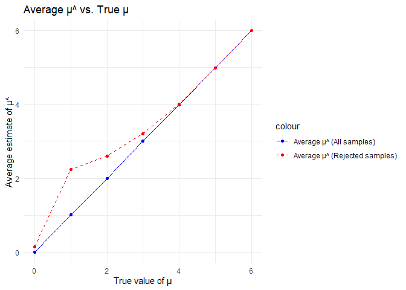
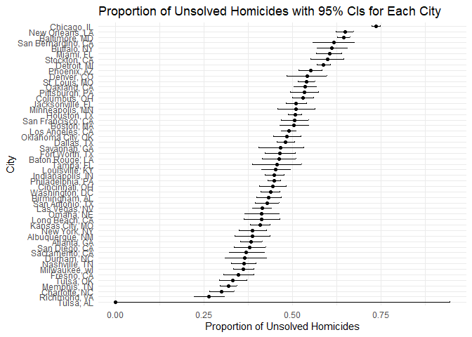

p8105_hw5_yj2802
================
Yizhen Jia
2024-11-15

``` r
library(tidyverse)
```

    ## ── Attaching core tidyverse packages ──────────────────────── tidyverse 2.0.0 ──
    ## ✔ dplyr     1.1.4     ✔ readr     2.1.5
    ## ✔ forcats   1.0.0     ✔ stringr   1.5.1
    ## ✔ ggplot2   3.5.1     ✔ tibble    3.2.1
    ## ✔ lubridate 1.9.3     ✔ tidyr     1.3.1
    ## ✔ purrr     1.0.2     
    ## ── Conflicts ────────────────────────────────────────── tidyverse_conflicts() ──
    ## ✖ dplyr::filter() masks stats::filter()
    ## ✖ dplyr::lag()    masks stats::lag()
    ## ℹ Use the conflicted package (<http://conflicted.r-lib.org/>) to force all conflicts to become errors

``` r
library(broom)
```

## Problem 1

``` r
birthday = function(n) {
  birthdays = sample(1:365, n, replace = TRUE)
  return(any(duplicated(birthdays)))
}

simulate_probabilities = function(min_size, max_size, simulations) {
  results = tibble(
    group_size = min_size:max_size,
    probability = map_dbl(min_size:max_size, ~{
      mean(replicate(simulations, birthday(.x)))
    })
  )
  return(results)
}

min_group_size = 2
max_group_size = 50
simulations = 10000
results = simulate_probabilities(min_group_size, max_group_size, simulations)

ggplot(results, aes(x = group_size, y = probability)) +
  geom_line() +
  labs(
    title = "Probability of Shared Birthdays in a Group",
    x = "Group Size",
    y = "Probability"
  ) +
  theme_minimal()
```

<!-- -->

As the group size increases, the probability of at least two people
sharing a birthday rises rapidly. The probability crosses 50% around
group size 23, illustrating the birthday paradox.

## Problem 2

``` r
set.seed(123)

n = 30
sigma = 5
alpha = 0.05
sims = 5000
mu_vals = c(0, 1, 2, 3, 4, 5, 6)

power = c()
mean_all = c()
mean_rej = c()

for (mu in mu_vals) {
  res = replicate(sims, {
    data = rnorm(n, mean = mu, sd = sigma)
    t_test = t.test(data, mu = 0) |> tidy()
    list(est = t_test$estimate, p = t_test$p.value)
  }, simplify = FALSE) |> bind_rows()
  power = c(power, mean(res$p < alpha))
  mean_all = c(mean_all, mean(res$est))
  mean_rej = c(mean_rej, mean(res$est[res$p < alpha]))
}

# Create a single data frame
p2 = tibble(mu = mu_vals, power = power, mean_all = mean_all, mean_rej = mean_rej)

# Plot Power vs. True μ
ggplot(p2, aes(x = mu, y = power)) +
  geom_line() +
  geom_point() +
  labs(x = "True value of μ", y = "Proportion of Null Rejections (Power)", title = "Power vs. Effect Size (True μ)") +
  theme_minimal()
```

<!-- -->

``` r
# Plot Average estimate μ^ vs. True μ
ggplot(p2, aes(x = mu)) +
  geom_line(aes(y = mean_all, color = "Average μ^ (All samples)")) +
  geom_point(aes(y = mean_all, color = "Average μ^ (All samples)")) +
  geom_line(aes(y = mean_rej, color = "Average μ^ (Rejected samples)"), linetype = "dashed") +
  geom_point(aes(y = mean_rej, color = "Average μ^ (Rejected samples)")) +
  labs(x = "True value of μ", y = "Average estimate of μ^", title = "Average μ^ vs. True μ") +
  scale_color_manual(values = c("Average μ^ (All samples)" = "blue", "Average μ^ (Rejected samples)" = "red")) +
  theme_minimal()
```

<!-- -->

## Problem 3

``` r
url = "https://raw.githubusercontent.com/washingtonpost/data-homicides/master/homicide-data.csv"
homicides = read_csv(url)
```

    ## Rows: 52179 Columns: 12
    ## ── Column specification ────────────────────────────────────────────────────────
    ## Delimiter: ","
    ## chr (9): uid, victim_last, victim_first, victim_race, victim_age, victim_sex...
    ## dbl (3): reported_date, lat, lon
    ## 
    ## ℹ Use `spec()` to retrieve the full column specification for this data.
    ## ℹ Specify the column types or set `show_col_types = FALSE` to quiet this message.

The raw data homicides have 52179 ovservations and 12 variables. The
included variables are: uid, reported_date, victim_last, victim_first,
victim_race, victim_age, victim_sex, city, state, lat, lon, disposition.

``` r
p3 = homicides |>
  mutate(city_state = paste(city, state, sep = ", ")) |>
  group_by(city_state) |>
  summarize(
    total_homicides = n(),
    unsolved_homicides = sum(disposition %in% c("Closed without arrest", "Open/No arrest")),
    .groups = "drop"
  )

results = p3 |>
  mutate(
    prop_test = map2(unsolved_homicides, total_homicides, ~ prop.test(.x, .y)),
    tidy_result = map(prop_test, tidy)
  ) |>
  unnest(cols = tidy_result) |>
  select(city_state, estimate, conf.low, conf.high)
```

    ## Warning: There was 1 warning in `mutate()`.
    ## ℹ In argument: `prop_test = map2(unsolved_homicides, total_homicides,
    ##   ~prop.test(.x, .y))`.
    ## Caused by warning in `prop.test()`:
    ## ! Chi-squared approximation may be incorrect

``` r
results = results |>
  arrange(desc(estimate))

ggplot(results, aes(x = reorder(city_state, estimate), y = estimate)) +
  geom_point() +
  geom_errorbar(aes(ymin = conf.low, ymax = conf.high), width = 0.2) +
  coord_flip() +
  labs(
    x = "City",
    y = "Proportion of Unsolved Homicides",
    title = "Proportion of Unsolved Homicides with 95% CIs for Each City"
  ) +
  theme_minimal()
```

<!-- -->
