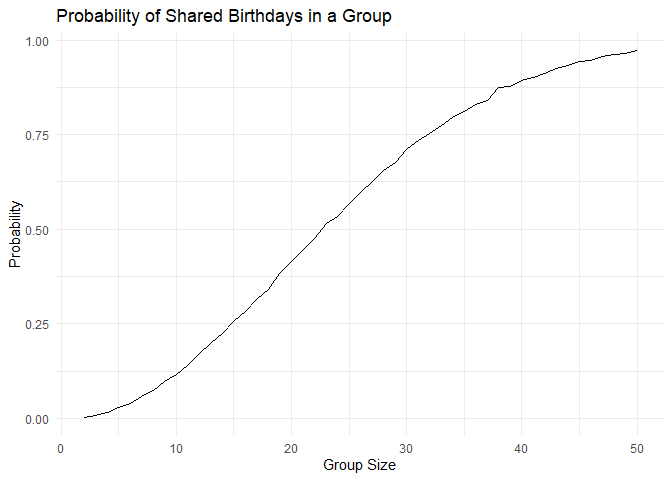
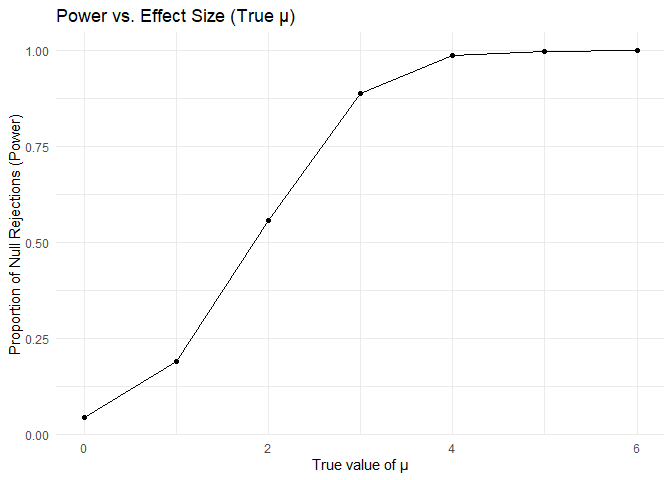
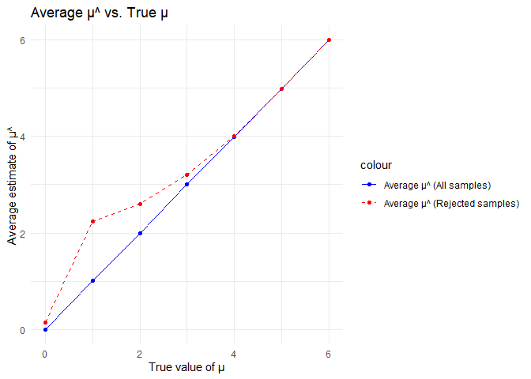
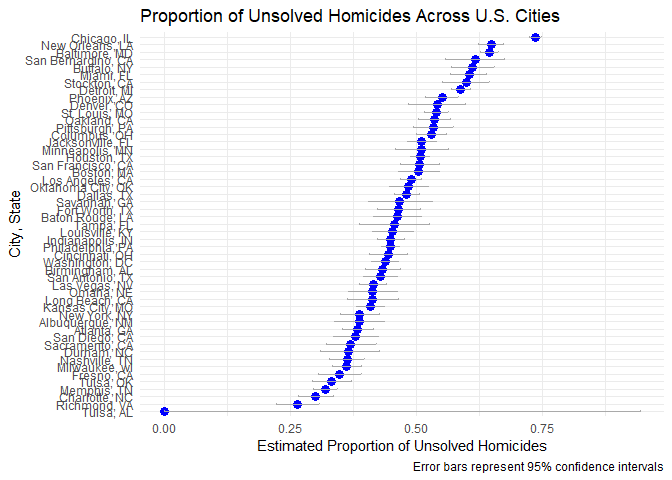

p8105_hw5_yj2802
================
Yizhen Jia
2024-11-16

``` r
library(tidyverse)
```

    ## ── Attaching core tidyverse packages ──────────────────────── tidyverse 2.0.0 ──
    ## ✔ dplyr     1.1.4     ✔ readr     2.1.5
    ## ✔ forcats   1.0.0     ✔ stringr   1.5.1
    ## ✔ ggplot2   3.5.1     ✔ tibble    3.2.1
    ## ✔ lubridate 1.9.3     ✔ tidyr     1.3.1
    ## ✔ purrr     1.0.2     
    ## ── Conflicts ────────────────────────────────────────── tidyverse_conflicts() ──
    ## ✖ dplyr::filter() masks stats::filter()
    ## ✖ dplyr::lag()    masks stats::lag()
    ## ℹ Use the conflicted package (<http://conflicted.r-lib.org/>) to force all conflicts to become errors

``` r
library(rvest)
```

    ## 
    ## Attaching package: 'rvest'
    ## 
    ## The following object is masked from 'package:readr':
    ## 
    ##     guess_encoding

``` r
library(broom)
library(knitr)
```

## Problem 1

``` r
birthday = function(n) {
  birthdays = sample(1:365, n, replace = TRUE)
  return(any(duplicated(birthdays)))
}

simulate_probabilities = function(min_size, max_size, simulations) {
  results = tibble(
    group_size = min_size:max_size,
    probability = map_dbl(min_size:max_size, ~{
      mean(replicate(simulations, birthday(.x)))
    })
  )
  return(results)
}

min_group_size = 2
max_group_size = 50
simulations = 10000
results = simulate_probabilities(min_group_size, max_group_size, simulations)

ggplot(results, aes(x = group_size, y = probability)) +
  geom_line() +
  labs(
    title = "Probability of Shared Birthdays in a Group",
    x = "Group Size",
    y = "Probability"
  ) +
  theme_minimal()
```

<!-- -->

As the group size increases, the probability of at least two people
sharing a birthday rises rapidly. The probability crosses 50% around
group size 23, illustrating the birthday paradox.

## Problem 2

``` r
set.seed(123)

n = 30
sigma = 5
alpha = 0.05
sims = 5000
mu_vals = c(0, 1, 2, 3, 4, 5, 6)

power = c()
mean_all = c()
mean_rej = c()

for (mu in mu_vals) {
  res = replicate(sims, {
    data = rnorm(n, mean = mu, sd = sigma)
    t_test = t.test(data, mu = 0) |> tidy()
    list(est = t_test$estimate, p = t_test$p.value)
  }, simplify = FALSE) |> bind_rows()
  power = c(power, mean(res$p < alpha))
  mean_all = c(mean_all, mean(res$est))
  mean_rej = c(mean_rej, mean(res$est[res$p < alpha]))
}

p2 = tibble(mu = mu_vals, power = power, mean_all = mean_all, mean_rej = mean_rej)

ggplot(p2, aes(x = mu, y = power)) +
  geom_line() +
  geom_point() +
  labs(x = "True value of μ", y = "Proportion of Null Rejections (Power)", title = "Power vs. Effect Size (True μ)") +
  theme_minimal()
```

<!-- -->

As the effect size increases, the power of the test rises rapidly,
indicating a higher likelihood of detecting a true effect. The
relationship is non-linear, with power increasing quickly for moderate
effect sizes and plateauing as the effect size becomes large.

``` r
ggplot(p2, aes(x = mu)) +
  geom_line(aes(y = mean_all, color = "Average μ^ (All samples)")) +
  geom_point(aes(y = mean_all, color = "Average μ^ (All samples)")) +
  geom_line(aes(y = mean_rej, color = "Average μ^ (Rejected samples)"), linetype = "dashed") +
  geom_point(aes(y = mean_rej, color = "Average μ^ (Rejected samples)")) +
  labs(x = "True value of μ", y = "Average estimate of μ^", title = "Average μ^ vs. True μ") +
  scale_color_manual(values = c("Average μ^ (All samples)" = "blue", "Average μ^ (Rejected samples)" = "red")) +
  theme_minimal()
```

<!-- -->

Is the sample average of μ^ across tests for which the null is rejected
approximately equal to the true value of μ? Why or why not?

No, the sample average of 𝜇̂ across tests for which the null is rejected
is not exactly equal to the true value of μ, especially for smaller μ
values. This is because samples that lead to rejection of the null tend
to have more extreme values, introducing a positive bias in the average
estimate.

## Problem 3

``` r
url = "https://raw.githubusercontent.com/washingtonpost/data-homicides/master/homicide-data.csv"
homicides = read_csv(url)
```

    ## Rows: 52179 Columns: 12
    ## ── Column specification ────────────────────────────────────────────────────────
    ## Delimiter: ","
    ## chr (9): uid, victim_last, victim_first, victim_race, victim_age, victim_sex...
    ## dbl (3): reported_date, lat, lon
    ## 
    ## ℹ Use `spec()` to retrieve the full column specification for this data.
    ## ℹ Specify the column types or set `show_col_types = FALSE` to quiet this message.

The raw data homicides have 52179 ovservations and 12 variables. The
included variables are: uid, reported_date, victim_last, victim_first,
victim_race, victim_age, victim_sex, city, state, lat, lon, disposition.

``` r
homicides = read_csv(url) |> 
  mutate(city_state = paste(city, state, sep = ", "))
```

    ## Rows: 52179 Columns: 12
    ## ── Column specification ────────────────────────────────────────────────────────
    ## Delimiter: ","
    ## chr (9): uid, victim_last, victim_first, victim_race, victim_age, victim_sex...
    ## dbl (3): reported_date, lat, lon
    ## 
    ## ℹ Use `spec()` to retrieve the full column specification for this data.
    ## ℹ Specify the column types or set `show_col_types = FALSE` to quiet this message.

``` r
city_summary = homicides |> 
  group_by(city_state) |> 
  summarize(
    total_homicides = n(),
    unsolved_homicides = sum(disposition %in% c("Closed without arrest", "Open/No arrest")),
    .groups = "drop"
  )

baltimore_summary = homicides |> 
  filter(city_state == "Baltimore, MD") |> 
  summarize(
    total_homicides = n(),
    unsolved_homicides = sum(disposition %in% c("Closed without arrest", "Open/No arrest"))
  )

baltimore_test = prop.test(
  baltimore_summary$unsolved_homicides, 
  baltimore_summary$total_homicides
) |> 
  broom::tidy() |> 
  select(estimate, conf.low, conf.high)

baltimore_table = baltimore_test |> 
  mutate(
    city = "Baltimore, MD",
    estimate = round(estimate, 3),
    conf.low = round(conf.low, 3),
    conf.high = round(conf.high, 3)
  ) |> 
  select(city, estimate, conf.low, conf.high)

knitr::kable(
  baltimore_table, 
  caption = "Proportion of Unsolved Homicides in Baltimore, MD"
)
```

| city          | estimate | conf.low | conf.high |
|:--------------|---------:|---------:|----------:|
| Baltimore, MD |    0.646 |    0.628 |     0.663 |

Proportion of Unsolved Homicides in Baltimore, MD

``` r
city_results = city_summary |> 
  mutate(
    prop_test = map2(unsolved_homicides, total_homicides, ~ prop.test(.x, .y)),
    tidy_results = map(prop_test, tidy)
  ) |> 
  unnest(cols = tidy_results) |> 
  select(city_state, estimate, conf.low, conf.high)
```

    ## Warning: There was 1 warning in `mutate()`.
    ## ℹ In argument: `prop_test = map2(unsolved_homicides, total_homicides,
    ##   ~prop.test(.x, .y))`.
    ## Caused by warning in `prop.test()`:
    ## ! Chi-squared approximation may be incorrect

``` r
city_table = city_results |> 
  arrange(city_state) |>
  mutate(
    estimate = round(estimate, 3),
    conf.low = round(conf.low, 3),
    conf.high = round(conf.high, 3)
  ) |> 
  rename(
    `City, State` = city_state,
    `Proportion` = estimate,
    `Lower CI` = conf.low,
    `Upper CI` = conf.high
  )

knitr::kable(
  city_table, 
  caption = "Proportion of Unsolved Homicides Across U.S. Cities"
)
```

| City, State        | Proportion | Lower CI | Upper CI |
|:-------------------|-----------:|---------:|---------:|
| Albuquerque, NM    |      0.386 |    0.337 |    0.438 |
| Atlanta, GA        |      0.383 |    0.353 |    0.415 |
| Baltimore, MD      |      0.646 |    0.628 |    0.663 |
| Baton Rouge, LA    |      0.462 |    0.414 |    0.511 |
| Birmingham, AL     |      0.434 |    0.399 |    0.469 |
| Boston, MA         |      0.505 |    0.465 |    0.545 |
| Buffalo, NY        |      0.612 |    0.569 |    0.654 |
| Charlotte, NC      |      0.300 |    0.266 |    0.336 |
| Chicago, IL        |      0.736 |    0.724 |    0.747 |
| Cincinnati, OH     |      0.445 |    0.408 |    0.483 |
| Columbus, OH       |      0.530 |    0.500 |    0.560 |
| Dallas, TX         |      0.481 |    0.456 |    0.506 |
| Denver, CO         |      0.542 |    0.485 |    0.598 |
| Detroit, MI        |      0.588 |    0.569 |    0.608 |
| Durham, NC         |      0.366 |    0.310 |    0.426 |
| Fort Worth, TX     |      0.464 |    0.422 |    0.507 |
| Fresno, CA         |      0.347 |    0.305 |    0.391 |
| Houston, TX        |      0.507 |    0.489 |    0.526 |
| Indianapolis, IN   |      0.449 |    0.422 |    0.477 |
| Jacksonville, FL   |      0.511 |    0.482 |    0.540 |
| Kansas City, MO    |      0.408 |    0.380 |    0.437 |
| Las Vegas, NV      |      0.414 |    0.388 |    0.441 |
| Long Beach, CA     |      0.413 |    0.363 |    0.464 |
| Los Angeles, CA    |      0.490 |    0.469 |    0.511 |
| Louisville, KY     |      0.453 |    0.412 |    0.495 |
| Memphis, TN        |      0.319 |    0.296 |    0.343 |
| Miami, FL          |      0.605 |    0.569 |    0.640 |
| Milwaukee, wI      |      0.361 |    0.333 |    0.391 |
| Minneapolis, MN    |      0.511 |    0.459 |    0.563 |
| Nashville, TN      |      0.362 |    0.329 |    0.398 |
| New Orleans, LA    |      0.649 |    0.623 |    0.673 |
| New York, NY       |      0.388 |    0.349 |    0.427 |
| Oakland, CA        |      0.536 |    0.504 |    0.569 |
| Oklahoma City, OK  |      0.485 |    0.447 |    0.524 |
| Omaha, NE          |      0.413 |    0.365 |    0.463 |
| Philadelphia, PA   |      0.448 |    0.430 |    0.466 |
| Phoenix, AZ        |      0.551 |    0.518 |    0.584 |
| Pittsburgh, PA     |      0.534 |    0.494 |    0.573 |
| Richmond, VA       |      0.263 |    0.223 |    0.308 |
| Sacramento, CA     |      0.370 |    0.321 |    0.421 |
| San Antonio, TX    |      0.429 |    0.395 |    0.463 |
| San Bernardino, CA |      0.618 |    0.558 |    0.675 |
| San Diego, CA      |      0.380 |    0.335 |    0.426 |
| San Francisco, CA  |      0.507 |    0.468 |    0.545 |
| Savannah, GA       |      0.467 |    0.404 |    0.532 |
| St. Louis, MO      |      0.540 |    0.515 |    0.564 |
| Stockton, CA       |      0.599 |    0.552 |    0.645 |
| Tampa, FL          |      0.457 |    0.388 |    0.527 |
| Tulsa, AL          |      0.000 |    0.000 |    0.945 |
| Tulsa, OK          |      0.331 |    0.293 |    0.371 |
| Washington, DC     |      0.438 |    0.411 |    0.465 |

Proportion of Unsolved Homicides Across U.S. Cities

``` r
# Create a ggplot
ggplot(city_results |> mutate(city_state = reorder(city_state, estimate)), aes(x = city_state, y = estimate)) +
  geom_point(color = "blue", size = 3) +
  geom_errorbar(aes(ymin = conf.low, ymax = conf.high), width = 0.2, color = "darkgray") +
  coord_flip() +
  labs(
    title = "Proportion of Unsolved Homicides Across U.S. Cities",
    x = "City, State",
    y = "Estimated Proportion of Unsolved Homicides",
    caption = "Error bars represent 95% confidence intervals"
  ) +
  theme_minimal()
```

<!-- -->
